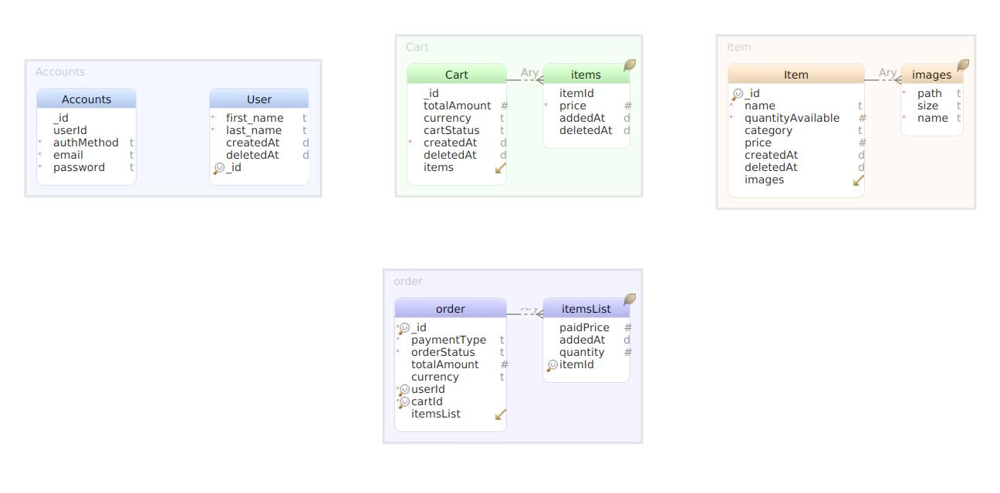

# Shopping api


## Table of Contents

<!-- vscode-markdown-toc -->
0. [Requirements](#Requirements)
1. [Intro](#Intro)
2. [Challenge](#Intro)
3. [Shopping-frontend](#ShoppingFrontend)
4. [Installation](#Installation)
    1. [Node](#Node)
    2. [Makefile](#Makefile)
    3. [Docker](#Docker)
5. [Usage](#Usage)
6. [Database](#Database)
7. [Tests](#Tests)
8. [License](#License)
9. [Next steps](#NextSteps)


## 0. <a name='Requirements'></a>Requirements

Before of all take a look at .env.sample file which contains the necessary keys for the application works properly.

Create a file name .env and set the keys from .env.sample

## 1. <a name='Intro'></a>Intro

The shopping-api is an api graphql based built in express used to basic ecomerce functions, such as list produts, add and remove them from a cart, cart manipulation and checkout. Initially it was desined to consider a default user without authentication.

### 1.2. Database architecture



## 4. 📦 <a name='ShoppingFrontend'></a>Shopping Frontend

This api it was designed based on the [shopping-cart-react](https://github.com/cdjohnnatha/shopping-cart-react)

# Install and build api and frontend together:
## 4.1 📦 <a name='folderCreation'></a>Folder creation
```
  $ mkdir shopping
  $ cd shopping
  $ touch docker-compose.yaml
```

## 4.2 Open the docker-compose.yaml and use as base the setup bellow:

```
  version: '3.8'

services:
  mongodb:
    image: mongo
    restart: unless-stopped
    # environment:
      # - MONGO_INITDB_ROOT_USERNAME=admin
      # - MONGO_INITDB_ROOT_PASSWORD=admin
    ports:
      - 27017:27017
    volumes:
      - mongo_shared:/data/db
  shopping-frontend:
    build:
        context: ./shopping-frontend
    command: npm start
    container_name: shopping-frontend
    restart: unless-stopped
    ports:
      - 4200:3000
    volumes:
      - ./shopping-frontend:/usr/src/app
      # - /shopping-frontend/node_modules
  shopping-api:
    build:
        context: ./shopping-api
    command: npm run dev
    container_name: shopping-api
    environment:
      - MONGO_HOST=mongodb
      - MONGO_PORT=27017
    restart: unless-stopped
    ports:
      - 3000:3000
    links:
      - mongodb
    depends_on:
      - mongodb
    volumes:
      - ./shopping-api:/usr/src/app
      # - /shopping-api/node_modules
volumes:
  mongo_shared:
```
## 4.3 Clone both projects at the directory

```
    $   git clone https://github.com/cdjohnnatha/shopping-api

    $ git clone https://github.com/cdjohnnatha/shopping-cart-react
```

## 4.4 Run the project
```
    $   docker-compose up
```

# Run Standalone project
## 3. 📦 <a name='Installation'></a>Installation

You have 3 options to setup the project use one of them.
1. Docker
2. Makefile
3. Node

### 3.0 Dependencies
#### 3.0.1

**It is highly recommend to use docker otherwhise you have to consider install [mongodb](https://docs.mongodb.com/manual/installation/) as well**

* [node](https://nodejs.org/en/)
* [docker](https://docs.docker.com/engine/install/ubuntu/)
* [docker-compose](https://docs.docker.com/compose/install/)

### 3.1 Node
Inside of project directory run the commands bellow:
```
  npm install
  npm start
```

### 3.2 Makefile
Inside of project directory run the commands bellow:
```
    make production
```
### 3.3 Docker

#### Dependencies

***You need to have a docker and docker-compose installed in your machine.***

```
    docker-compose up
```

## 4. 📖 <a name='Usage'></a>Usage

At very first beginning it is necessary to create a .env file to the application work properly.

You can take a look at .env.sample where you will find the keys necessary to run the project.

To run the production mode just:
```
    npm start
```

You can also teste the application in dev mode which a mock file with the same response structure from youtube, where it was used the keywords for search: 'best practices nodejs'.

You can run a dev mode as bellow:

```
    npm run dev
```

## 5. 📖 <a name='Database'></a>Database

The database used is Mongodb with mongoose.


The database initialization it will pretty much create the database, run the migrations and run all seeds:

### 5.1 Node

```
  npm run seeders
```

## 7. 📄 <a name='Tests'></a>Tests

You can run the applications tests with

```
  npm test
```

## 8. 📄 <a name='License'></a>License
Simple Object Handler is [MIT licensed](./LICENSE).